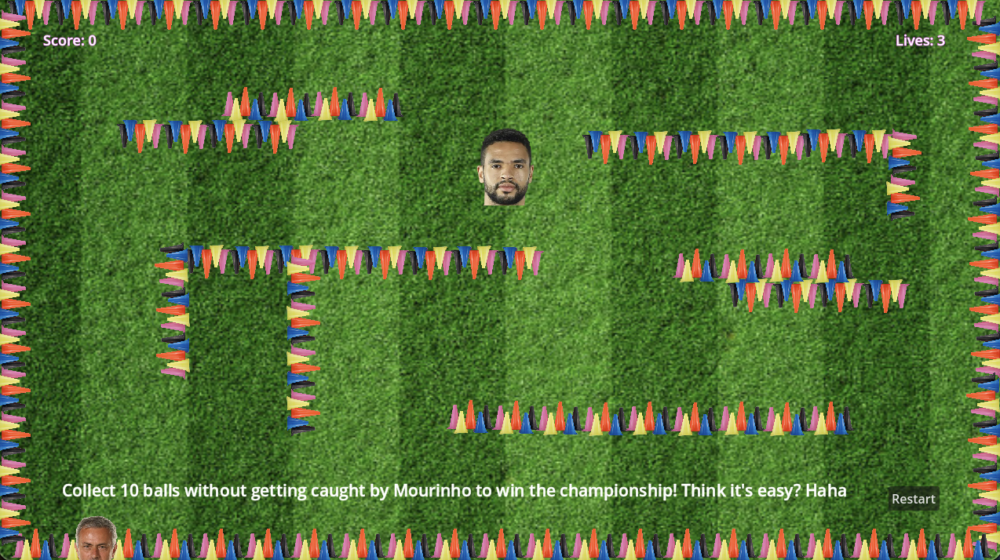
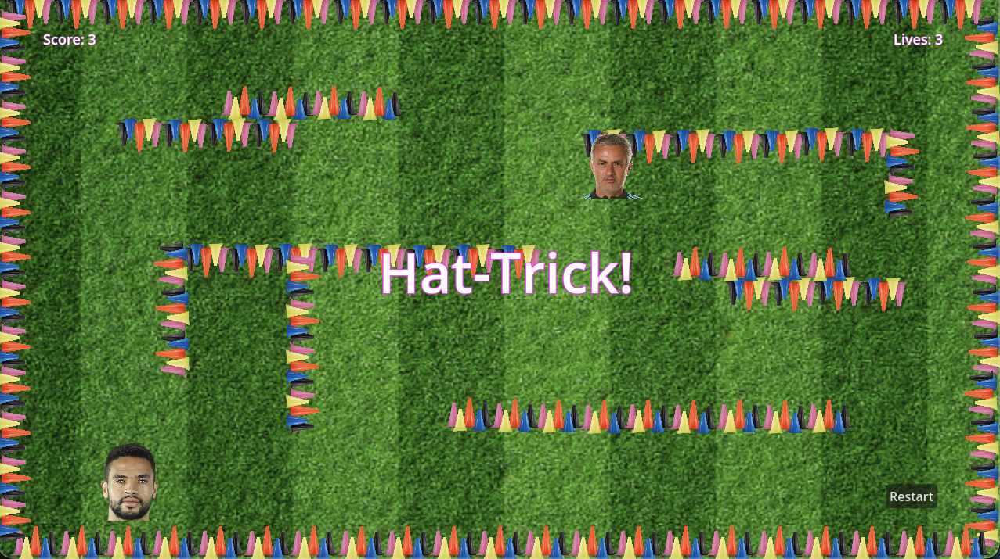
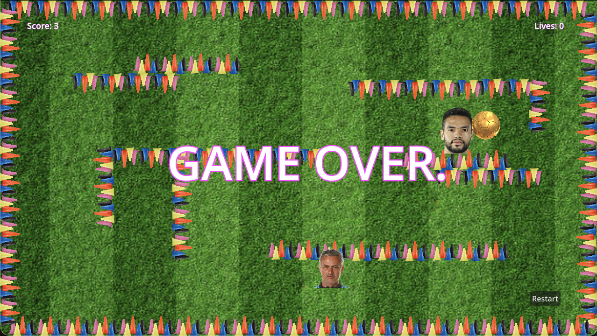

# Mourinhoball!

## Game Description
Welcome to Mourinhoball, a 2D platformer where you play as soccer player Youssef En-Nesyri, navigating platforms with up, down, right, left keys to collect 10 balls while avoiding hazards such as spiky cones and an animated manager Mourinho! The game challenges players to collect all the balls and claim the championship trophy while managing lives and dodging enemies.

## Core Mechanics
- Player Movement: Navigate the player using arrow keys to jump and move across platforms.
- Scoring: Collect balls to increase your score. Reach 10 goals to win the game.
- Lives System: Start the game with 3 lives. Losing all lives results in "Game Over."
- Dynamic Hazards: Avoid Mourinho and spikes, as they reduce lives on contact.
- Extra Feedback:
  - At 3 goals: "Hat Trick!" message appears, accompanied by applause sound.
  - At 5 goals: "King Scorer!" message appears, again with applause sound.

## Screenshots
- Main Gameplay View: 


- Scoring System:


- Game Over:


## Compilation Steps
1. Clone the repository.
2. Build the GDExtension: 	``` scons platform=macos ```
3. Open in Godot by launching Godot 4.3. and importing the project by selecting the project.godot file in the repository folder.
4. Run the game by pressing the Play button in Godot.

## Game Feautures
1. Ball Collection:
- Collect 10 balls to win the game.
2. Lives System:
- Start with 3 lives.
- Lose lives when colliding with the enemy or spikes.
3. Hazards:
- Avoid enemiy that moves randomly on the screen.
- Avoid spikes.

## Enhanced Input Handling Module
The module is designed to extend and enhance Godot’s default input system by introducing features like debouncing, key combinations, and the ability to pause and resume the game during gameplay. The input handling is particularly aimed at improving the gameplay experience by allowing players to control the game more efficiently and with more flexibility.

### Debounced Key Presses:
The module ensures that rapid key presses for movement do not register as multiple presses. It avoids accidental input misfires by introducing a debouncing mechanism for smoother and more precise control.
### Special Key Combinations:
- Shift + W, A, S, D, Arrow Keys: Movement controls for player navigation.
- Shift + P: Pauses and resumes the game.
### Pause and Resume Game:
The game can be paused using Shift + P, and pressing it again resumes the game. The pause functionality halts all in-game physics, character movement, and gameplay. **The game is completely unpausable once the player loses all lives.**

## Testing
### Movement Controls:
- All movement keys (WASD, Arrow Keys) were tested to ensure they correctly control the character's position.
- Shift key for sprinting was tested to ensure it only affects movement speed when a movement key is pressed.
### Debouncing:
- Multiple quick key presses were tested for movement controls to ensure that rapid or repeated presses were debounced, and the character responded only to the first press within a time window.
### Pause and Resume:
- The Shift + P combination was tested in both paused and unpaused states. The game paused correctly when the player pressed Shift + P and resumed when pressed again. The game stops processing during the paused state, ensuring no movement or action happens.
- Upon resuming the game after a loss (i.e., zero lives), the game should remain paused and unresumable until the game is restarted.
### Game Over State:
- The player’s lives were tracked accurately, and the game over state was tested to ensure the game stops when lives reach zero.
When the game is over, the game remains paused and unresumable until manually restarted.
### Integration with Existing Game Logic:
- The module was integrated into the existing project where movement controls, game over states, and scoring were already implemented. It was verified that the new input logic did not interfere with existing game mechanics, such as the score update or the decrement of lives.

## Video Demo
A gameplay demo video can be found here: [video link](https://www.youtube.com/watch?v=khrzwS_5jmM)